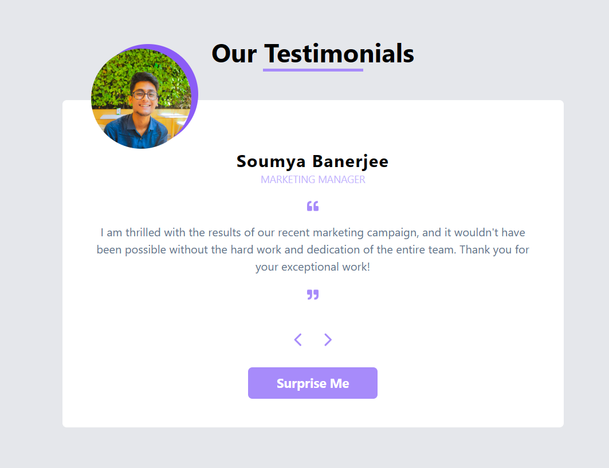

# Testimonial_slider

:rocket: [Link to website][https://studynotion-frontend.vercel.app/]

## Introduction
I recently had the pleasure of experiencing the testimonial slider created with React.js, and I must say it's a remarkable piece of work. The smooth and elegant transitions between testimonials provide a user-friendly and visually appealing way to showcase opinions and feedback. The interactive design, powered by React, not only enhances the overall user experience but also demonstrates the flexibility and power of this JavaScript library. As someone who values creativity and functionality, I find this testimonial slider to be a standout component, seamlessly blending form and function in a way that captivates and engages users. Kudos to the developer for delivering a stellar and modern solution for testimonials!"

Feel free to customize or modify the paragraph to better suit your needs or the specific features of your testimonial slider

